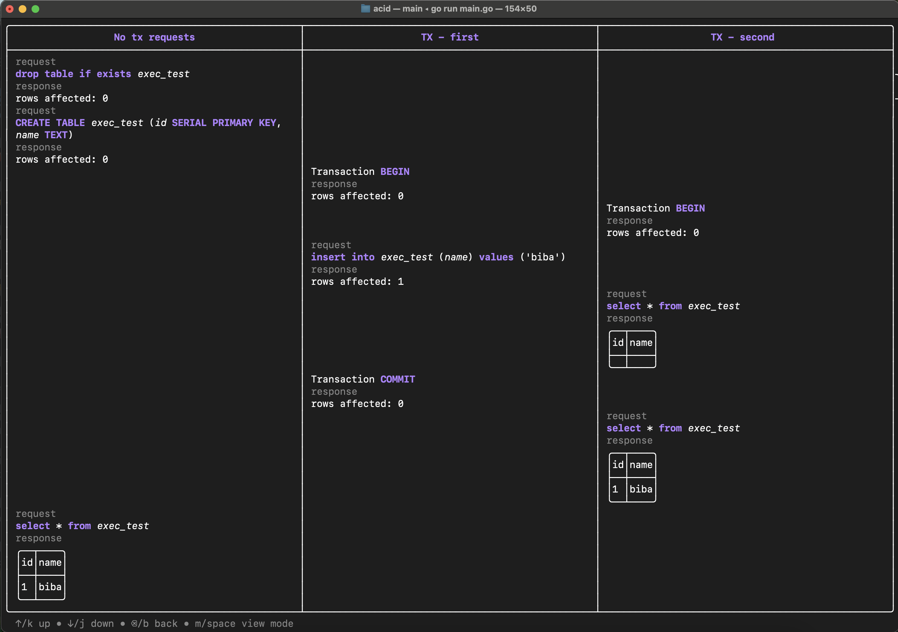

# acid
SQL interview questions learning tool

### Select call sequence example

### Run parallel transactions

# Usage

1. Clone project
2. Create `.env` file with database connection variables (see `.env.example`)
3. Edit queries in main.go
4. `go run main.go`
