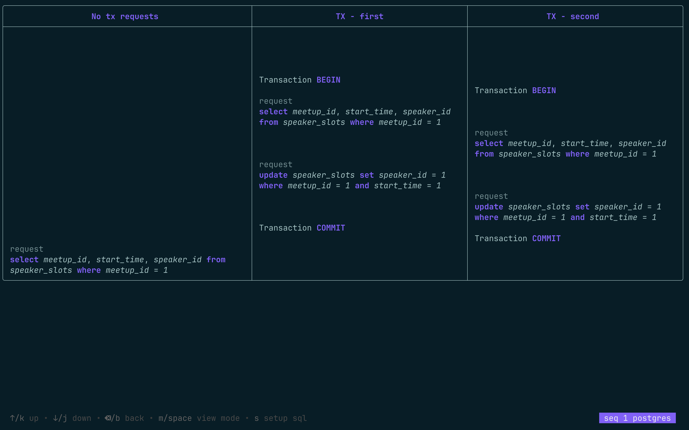
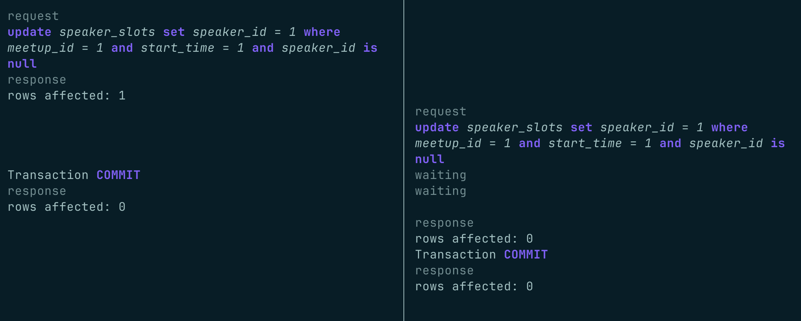

# ACID - SQL transactions learning

[](https://golang.org)
[](https://goreportcard.com/report/github.com/rusinikita/acid)
[](https://www.gnu.org/licenses/gpl-3.0)
[](https://github.com/rusinikita/acid)


[](https://t.me/nikitarusin)

A terminal-based visualization tool for testing SQL transaction sequences.

## Table of Contents
- [Why ACID?](#why-acid)
- [Demo](#demo)
- [Features](#features)
- [Quick Start](#quick-start)
- [Controls](#controls)
- [Contributing](#contributing)
- [License](#license)

## Why ACID?

Testing complex transaction scenarios usually requires:
- Opening multiple terminal windows
- Manually copying and pasting SQL commands in precise order  
- Coordinating timing between different sessions
- Managing database connections and states

**ACID eliminates this complexity** by letting you define entire scenarios in simple Go code and watch them run automatically with visual feedback.

Instead of juggling terminals, you get:
- **Automated execution** - No manual copy-paste between terminals
- **Real-time visualization** - Watch scenarios execute with live updates
- **Visual locks indicator** - See exactly when transactions are waiting
- **Quiz mode** - Hide results to test your understanding

Perfect for learning transaction behavior, debugging concurrency issues, and teaching database concepts. 

Get answers to your questions:
> - Do I lose data when another request happens at the same time?
> - What results do I get from a `SELECT` while another transaction is updating?
> - What happens with `SELECT COUNT(*) FROM table FOR UPDATE`?

## Demo

[](https://asciinema.org/a/738395)
☝️ click to open app demo video

👇 [Ru lang] Click to watch BigTech SQL essential knowledge video
[](https://youtu.be/KMx5b7zIi0w)

## Features

### Simple DSL for complex tests

```go
// Test isolation levels with concurrent transactions
call.Setup("DROP TABLE IF EXISTS users"),
call.Setup("CREATE TABLE users (id SERIAL PRIMARY KEY, name TEXT, balance INTEGER)"),
call.Setup("INSERT INTO users (name, balance) VALUES ('Alice', 1000), ('Bob', 500)"),

call.Begin(tx1), // Transaction 1: Transfer money  
call.Begin(tx2), // Transaction 2: Check balances

call.Call("UPDATE users SET balance = balance - 100 WHERE name = 'Alice'", tx1),
call.Call("SELECT balance FROM users WHERE name = 'Alice'", tx2), // What balance is shown?
call.Commit(tx1),
call.Call("SELECT balance FROM users WHERE name = 'Alice'", tx2), // What about now?
call.Commit(tx2),
```

Easily create runnable sequences:
- `Setup` for initialization SQL (hidden by default)
  - Press the `s` button to see initialization code call result
- `Begin`, `Commit`, `Rollback` parallel transactions
  - Argument: txID to start or finish
- `Call` SQL request
  - Second argument: txID to run SQL inside. If no txID is provided, runs as a single query transaction (begin → SQL call → commit) 


### Quiz mode

SQL sequences run with hidden responses, allowing you to test your understanding or quiz others on transaction behavior.



Press `m` or `space` to show responses.

### Locks visualisation

Every request runs concurrently, with the UI showing when transactions wait for resource access.



### Predefined sequences

Explore predefined sequences for common transaction scenarios.

## Quick Start (5 steps, ~2 minutes)

#### Prerequisites

> **⚠️ Requirements**
>
> This tool requires a running PostgreSQL or MySQL database

- Go 1.23+ to run program
- Docker and Docker Compose (for local databases run command)
- OR access to PostgreSQL/MySQL database

#### 1 - Clone project

```shell
git clone https://github.com/rusinikita/acid.git
```

#### 2 - Start database

Run PostgreSQL and MySQL in Docker

```shell
make rundbs
```

Or
```shell
docker compose up
```

Alternatively, you can create a cloud database in 3 minutes:
- [neon.com](https://neon.com) for postgres
- [planetscale.com](https://planetscale.com/) for mysql

#### 3 - Setup database link

Create `.env` file from `.env.example` content

```shell
cp .env.example .env
```

Edit the .env content:
- Simply uncomment your preferred database for docker compose
- Edit `DB_CONNECT` for your database link

```dotenv
# postgresql
 DB_DRIVER=postgres
 DB_CONNECT="host=localhost port=5432 user=acid password=strong_password_123 dbname=demo sslmode=disable"
# mysql
# DB_DRIVER=mysql
# DB_CONNECT="acid:strong_password_123@tcp(127.0.0.1:3306)/demo"
```

#### 4 - Run app

```shell
make run
```

Or

```shell
go run main.go
```

#### 5 - Have fun!

Use arrow keys to select a sequence and press Enter to run it.

Edit queries or create your own sequences in [sequence/sequences.go](sequence/sequences.go) file.

## Supported Databases

- PostgreSQL 
- MySQL

## Controls

| Key             | Action |
|-----------------|--------|
| `↑/↓`           | Navigate sequences |
| `Enter`         | Run selected sequence |
| `s`             | Show/hide setup steps |
| `m` or `Space`  | Toggle response visibility |
| `q` or `Ctrl+C` | Quit application |

## Contributing

We welcome contributions! Here's how you can help:

1. **Report Issues** - Found a bug or have a feature request? [Create an issue](https://github.com/rusinikita/acid/issues)
2. **Share Sequences** - Create interesting transaction scenarios in `sequence/sequences.go` 
3. **Improve Documentation** - Help make the README clearer
4. **Code Contributions** - Submit pull requests for bug fixes or features

## License

GPL-3.0 License - see [LICENSE](LICENSE) file for details.

