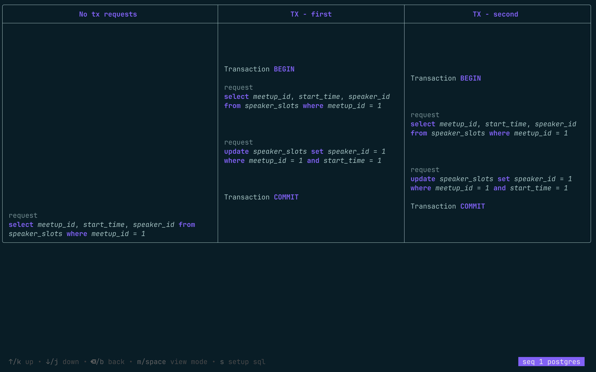
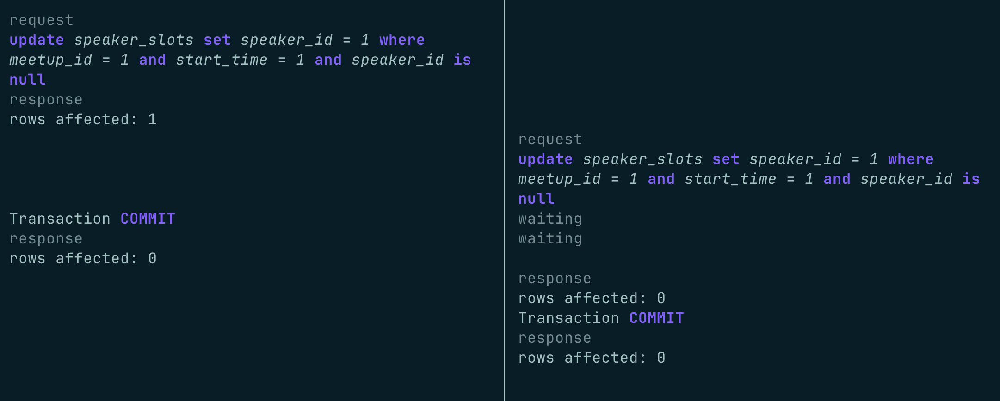

# ACID - SQL transactions learning

[](https://golang.org)
[](https://goreportcard.com/report/github.com/rusinikita/acid)
[](https://www.gnu.org/licenses/gpl-3.0)
[](https://github.com/rusinikita/acid)


[](https://t.me/nikitarusin)

A CLI tool to bootstrap and enhance LLM agent-driven database learning. A TUI visualizes multi-transaction scenarios executed on real databases, letting you observe transaction anomalies and gotchas firsthand.

## Table of Contents
- [Why ACID?](#why-acid)
- [Demo](#demo)
- [Features](#features)
- [AI-guided learning](#ai-guided-learning)
- [Quick Start](#quick-start)
- [Controls](#controls)
- [Contributing](#contributing)
- [License](#license)

## Why ACID?

**1. Zero to hero — deep understanding of database behavior**

Start from scratch and build real intuition for how databases handle concurrency. An AI coach walks you through each anomaly — dirty reads, lost updates, phantom reads, deadlocks — with live scenarios on a real database, not toy diagrams.

> *"I'm new to databases. Teach me ACID properties and transaction isolation from the ground up."*

**2. Interview prep and topic revision**

Quickly revisit specific concepts before a system design interview or when a topic feels fuzzy. Predict outcomes, get corrected, understand why — the prediction-first loop makes knowledge stick.

> *"I have a system design interview tomorrow. Run me through isolation levels and the most common concurrency gotchas."*

**3. Testing database behavior during feature design**

Unsure how your database will behave under concurrent writes? Write a scenario for your exact table structure and query pattern, run it, and see the real result before committing to an approach.

> *"I'm designing a booking system. Show me what happens when two users claim the last seat at the same time."*

## Demo

[](https://www.youtube.com/watch?v=8rke6HYa0SQ)
☝️ click to open app demo video

## Features

### Simple TOML scenarios

```toml
name = "Lost Update"
description = "Two transactions read and write the same row — only one update survives"
drop_tables = ["accounts"]

[[steps]]
sql = "CREATE TABLE accounts (id INT PRIMARY KEY, owner TEXT, balance INT)"
setup = true

[[steps]]
cmd = "begin"
trx = "alice"

[[steps]]
cmd = "begin"
trx = "bob"

[[steps]]
sql = "SELECT balance FROM accounts WHERE id = 1"
trx = "alice"

[[steps]]
sql = "SELECT balance FROM accounts WHERE id = 1"
trx = "bob"

[[steps]]
sql = "UPDATE accounts SET balance = balance - 100 WHERE id = 1"
trx = "alice"

[[steps]]
sql = "UPDATE accounts SET balance = balance - 100 WHERE id = 1"
trx = "bob"

[[steps]]
cmd = "commit"
trx = "alice"

[[steps]]
cmd = "commit"
trx = "bob"
```

Sequence building blocks:
- `setup = true` — initialization SQL, hidden by default (press `s` to show)
- `cmd = "begin" / "commit" / "rollback"` with a `trx` label — transaction lifecycle
- `sql = "..."` with a `trx` label — runs inside that transaction
- `sql = "..."` with no `trx` — auto-committed single-statement query

### Quiz mode

SQL sequences run with hidden responses, allowing you to test your understanding or quiz others on transaction behavior.



Press `m` or `space` to show responses.

### Locks visualization

Every request runs concurrently, with the UI showing when transactions wait for resource access.



### Predefined sequences

Explore predefined sequences for common transaction scenarios.

## AI-guided learning

The primary workflow pairs `acid serve` with an LLM agent (Claude, Gemini, or any agent that reads `AGENTS.md`) acting as a Socratic database coach.

```
Terminal 1                         Terminal 2
──────────────────────────────     ──────────────────────────────
make serve                         claude
  │                                  │
  │  acid serve starts on :7331      │  Agent reads AGENTS.md / CLAUDE.md
  │  Results hidden by default       │
  │                                  │  acid status          ← checks DB + server
  │  ┌─────────────────────┐         │  acid run -f sequences/lost_update.toml
  │  │ scenario plays out  │◄────────┤
  │  │ results are hidden  │         │  "What will the final balance be?"
  │  └─────────────────────┘         │
  │                                  │  [student answers]
  │  ┌─────────────────────┐         │
  │  │ results revealed    │◄────────┤  acid toggle
  │  └─────────────────────┘         │
  │                                  │  Debrief → next scenario
```

The agent writes new `.toml` files in `sequences/`, runs them with `acid run`, waits for your prediction, then calls `acid toggle` to reveal the results. `acid init` scaffolds the full environment including a pre-loaded coaching prompt in `AGENTS.md`/`CLAUDE.md`.

**Agent commands:**
```bash
acid status                              # verify DB connectivity and server health
acid run -f sequences/lost_update.toml  # stream scenario to the serve TUI
acid toggle                              # reveal results after student predicts
```

You can also run built-in sequences by name:
```bash
acid run "Lost Update"
acid run "Dirty Read"
acid run "Phantom Reads"
```

## Quick Start

#### 1 - Install

```bash
# macOS (Homebrew)
brew install --cask rusinikita/acid/acid

# Linux / macOS (shell script)
curl -fsSL https://raw.githubusercontent.com/rusinikita/acid/main/install.sh | sh
```

#### 2 - Scaffold a learning environment

```bash
acid init my-learning
cd my-learning
```

This creates `.env`, `AGENTS.md`/`CLAUDE.md` (AI coaching prompt), `learning_plan.md`, a `sequences/` folder with example TOML files, and a `Makefile`.

#### 3 - Start a database

init command creates docker-compose.yml and Makefile for convenience.

```bash
make pg       # PostgreSQL in Docker (matches .env default)
# or
make mysql    # MySQL in Docker
```

Or edit `.env` to point at an existing cloud database ([neon.com](https://neon.com) for PostgreSQL, [planetscale.com](https://planetscale.com/) for MySQL).

#### 4 - Open two terminal panes and start learning

```
FIRST    make serve     # starts acid serve on :7331
SECOND   claude         # or: gemini, or any LLM agent
```

Say **"Let's start"** — the agent verifies the server is up, then kicks off the first scenario.

#### Run scenarios manually at any time

```bash
acid run -f sequences/lost_update.toml
acid toggle    # reveal results
```

## Supported Databases

- PostgreSQL 
- MySQL

## Controls

| Key             | Action |
|-----------------|--------|
| `↑/↓`           | Navigate sequences |
| `Enter`         | Run selected sequence |
| `s`             | Show/hide setup steps |
| `m` or `Space`  | Toggle response visibility |
| `q` or `Ctrl+C` | Quit application |

## Contributing

We welcome contributions! Here's how you can help:

1. **Report Issues** - Found a bug or have a feature request? [Create an issue](https://github.com/rusinikita/acid/issues)
2. **Share Sequences** - Create interesting transaction scenarios as TOML files
3. **Improve Documentation** - Help make the README clearer
4. **Code Contributions** - Submit pull requests for bug fixes or features

## License

GPL-3.0 License - see [LICENSE](LICENSE) file for details.
